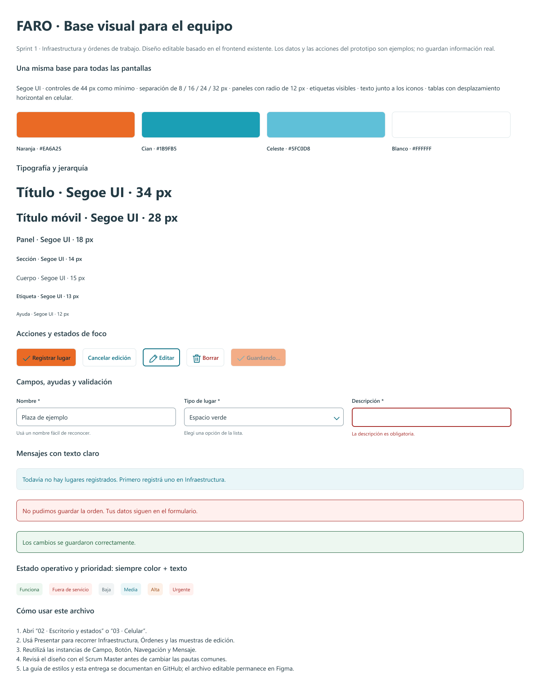
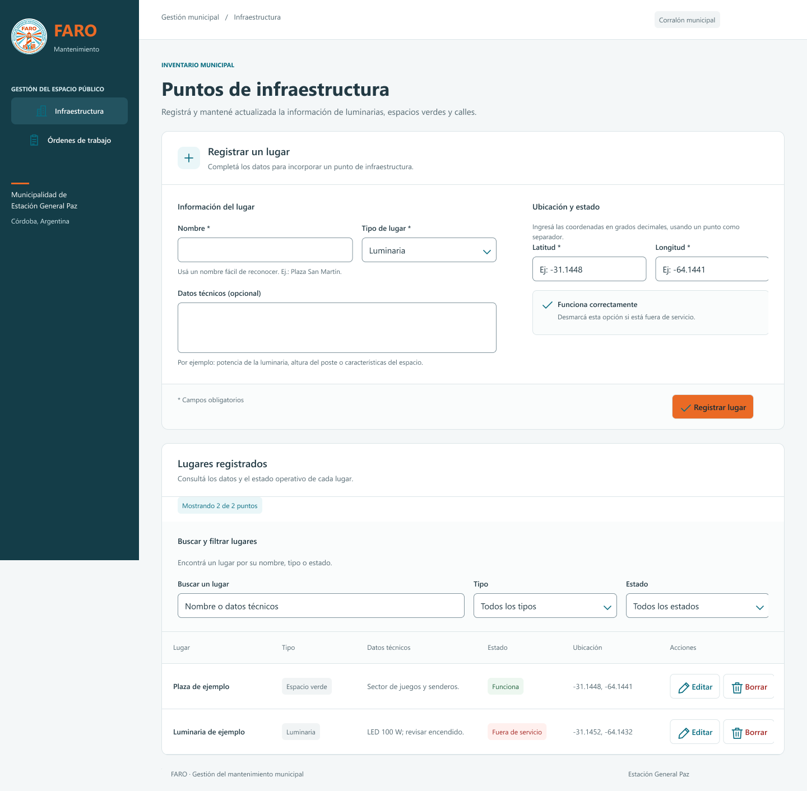
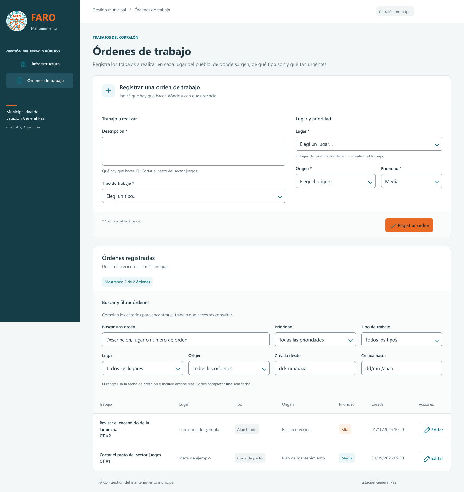

# Pantallas base de FARO en Figma

**Estado: avance de diseño, pendiente de completar y aprobar.**

Archivo editable: [FARO · Pantallas base · Sprint 1](https://www.figma.com/design/3CpJkDaWLjKQ9ARTw8Gkjp).
Tarea: [Setup de Entornos, Diseño y Calidad — Diseño de pantallas base en Figma](https://trello.com/c/GcRFSJFt/46-setup-de-entornos-dise%C3%B1o-y-calidad).

## Para qué sirve

Este archivo reúne la base visual que el equipo de frontend puede reutilizar al diseñar nuevas pantallas. Conserva la paleta institucional del Plan de Proyecto, Segoe UI y los controles del frontend existente. No cambia funcionalidades ni agrega operaciones sobre datos reales.

La guía de estilos de la aplicación permanece en [GUIA_ESTILOS.md](../GUIA_ESTILOS.md). El diseño editable permanece en Figma; GitHub conserva su alcance, enlaces y evidencia.

## Avance guardado

- Guía visual: cuatro colores institucionales, jerarquía de texto, medidas, botones, campos, mensajes y estados.
- Componentes editables: botones, campos de texto, selectores, áreas de texto, navegación, mensajes, etiquetas, encabezados, checkbox, iconos vectoriales y logo original.
- Segoe UI Regular, Semibold y Bold disponibles y verificadas en la herramienta de Figma.
- Catorce vistas de escritorio: Infraestructura base, edición, vacío y guardado; Órdenes base, edición, filtros activos, sin lugares, error de carga, sin coincidencias, fechas inválidas, validación, guardado y carga.
- Dos vistas completas para revisar los módulos sin el recorte de una ventana de escritorio.

[Guía visual](https://www.figma.com/design/3CpJkDaWLjKQ9ARTw8Gkjp?node-id=13-380)
· [Infraestructura](https://www.figma.com/design/3CpJkDaWLjKQ9ARTw8Gkjp?node-id=17-2)
· [Órdenes de trabajo](https://www.figma.com/design/3CpJkDaWLjKQ9ARTw8Gkjp?node-id=17-867)

Las capas de las pantallas son texto, vectores, contenedores e instancias de componentes. El logo es la imagen original. La referencia temporal capturada de la web fue retirada.

## Pautas comunes

| Elemento | Pauta |
|---|---|
| Paleta institucional | Naranja #EA6A25, cian #1B9FB5, celeste #5FC0D8 y blanco #FFFFFF |
| Tipografía | Segoe UI; títulos de 34 px en escritorio y 28 px en celular |
| Controles | Altura mínima de 44 px; etiqueta siempre visible |
| Espaciado | Reutilizar 8, 16, 24 y 32 px según el contenedor |
| Paneles | Radio de 12 px; controles de 7 px |
| Acciones | Texto junto a los iconos; acción principal naranja con texto oscuro |
| Mensajes | Explicar qué pasó y cómo seguir; conservar el contenido del formulario |
| Estados | Color acompañado de texto |
| Celular | Campos en una columna y tablas con desplazamiento dentro de su panel |

Para crear una pantalla, reutilizar las instancias de los componentes de la página “01 · Guía y componentes”. Las pautas de celular están definidas; las vistas nativas de celular todavía no están terminadas.

## Origen y límites de la revisión

Referencia de código: commit `0813917` de `feature/filtros-ordenes-trabajo`. Las pantallas de Órdenes y filtros corresponden a los [PR #13](https://github.com/mayex-gif/Faro/pull/13) y [PR #14](https://github.com/mayex-gif/Faro/pull/14), que estaban pendientes de integración al preparar este avance.

Los nombres de lugares, coordenadas, órdenes y fechas del diseño son datos ficticios. La herramienta pudo crear y guardar las vistas de escritorio, pero Figma alcanzó el límite de llamadas del plan Starter antes de completar las vistas de celular, las conexiones y toda la revisión visual. Por eso esta documentación y el archivo se entregan como avance.

La exportación de Infraestructura permitió detectar recortes en la descripción de marca y en algunos bordes o acciones del extremo derecho. Esos ajustes quedan registrados para resolverlos en el archivo editable antes de la entrega final.

## Pendientes y aceptación

- [ ] Corregir los recortes y revisar el tamaño y alineación de campos, navegación, mensajes y acciones.
- [ ] Terminar las vistas nativas de celular de Infraestructura y Órdenes.
- [ ] Conectar el prototipo: navegación entre módulos, edición, cancelación, guardado de ejemplo y filtros.
- [ ] Revisar en Figma las vistas base y todos los estados, incluyendo desplazamiento de tablas y textos largos.
- [ ] Actualizar las exportaciones después de corregir el diseño.
- [ ] Obtener la revisión del equipo y del Scrum Master.

El ítem de Figma en Trello se marca completo cuando estos pendientes de diseño estén resueltos. La tarjeta completa incluye otras actividades, por lo que su movimiento corresponde al estado conjunto y a la aceptación del equipo.

## Evidencia del avance

Las imágenes siguientes son exportaciones para revisar. No sustituyen las capas editables ni representan una entrega final aprobada.

